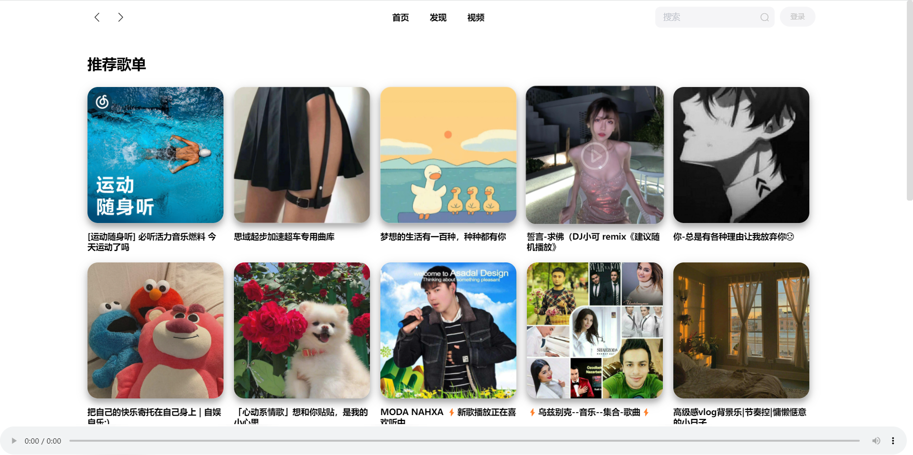
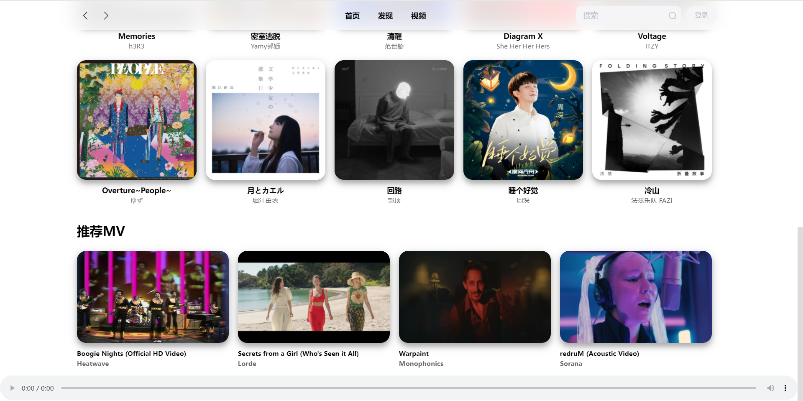
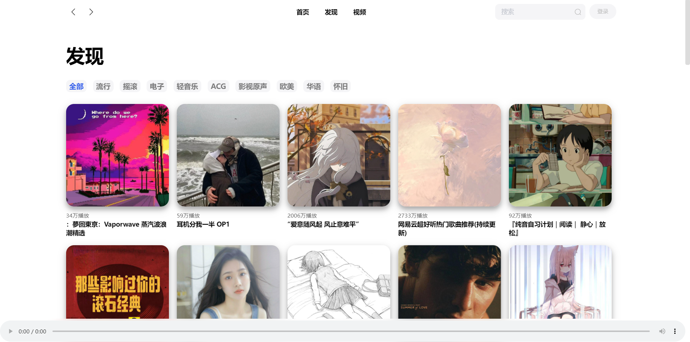
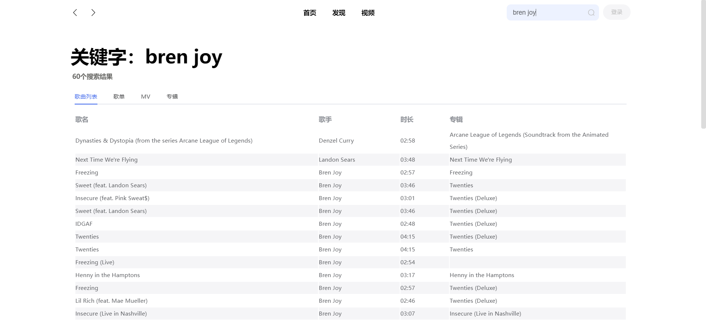

### 项目介绍

- 基于 Vue 的音乐播放器项目，初学 Vue 框架的第一个练手项目，UI 参考了 [YesPlayMusic](https://music.qier222.com/)，后端 API [NeteaseCloudMusicApi](https://github.com/Binaryify/NeteaseCloudMusicApi)，调用的 [接口文档](https://binaryify.github.io/NeteaseCloudMusicApi/#/?id=neteasecloudmusicapi)
- 功能实现
  - [x] 推荐歌单
  - [x] 最新音乐
  - [x] 推荐 MV
  - [x] 歌单分类
  - [x] MV 分类
  - [x] 歌单详情
  - [x] MV 详情
  - [x] 歌曲播放
  - [x] MV 播放
  - [x] 相关视频推荐
  - [x] 搜索功能（有点bug）
  - [ ] 登陆注册
  - [ ] 收藏歌单
  - [ ] 推荐歌手
  - [ ] 排行榜

### 技术栈

- vue-router
- axios
- element-ui

### 项目运行

- 安装依赖

  ```powershell
  yarn
  npm install
  ```

- 启动热更新服务器

  ```powershell
  yarn serve
  npm run serve
  ```

### 项目预览











